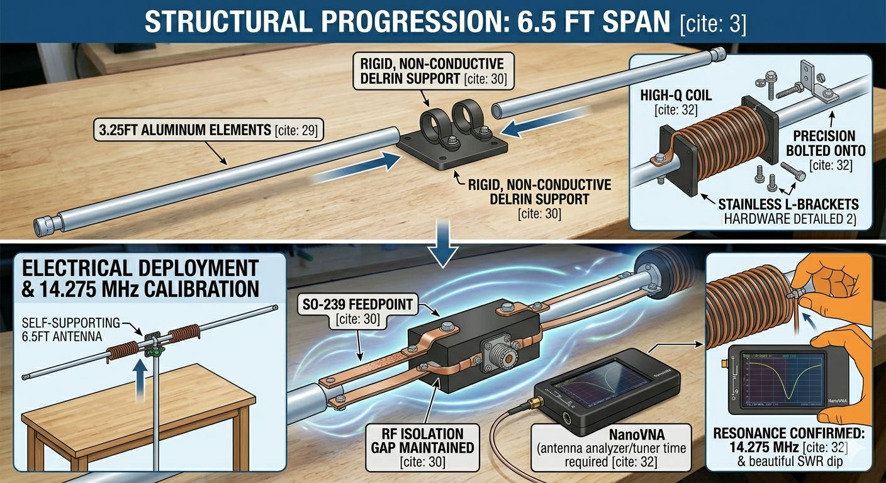
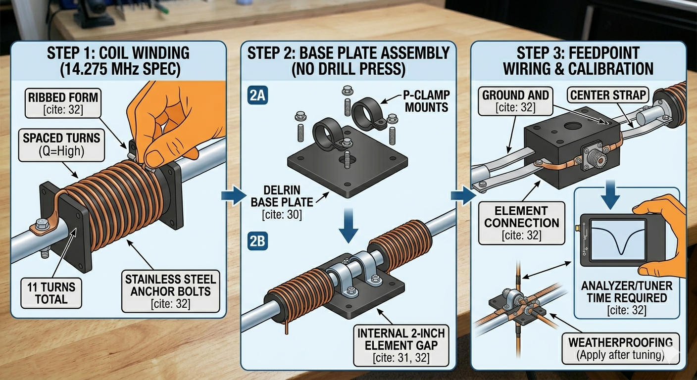
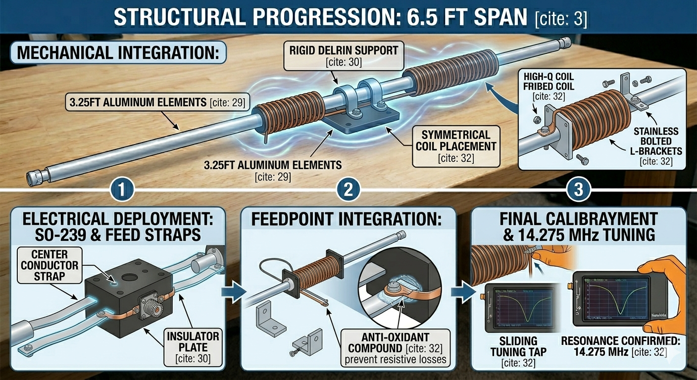
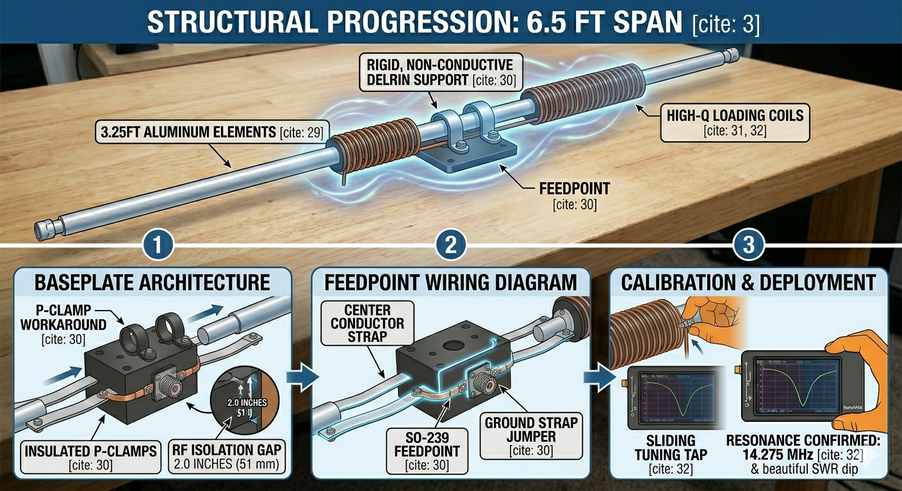
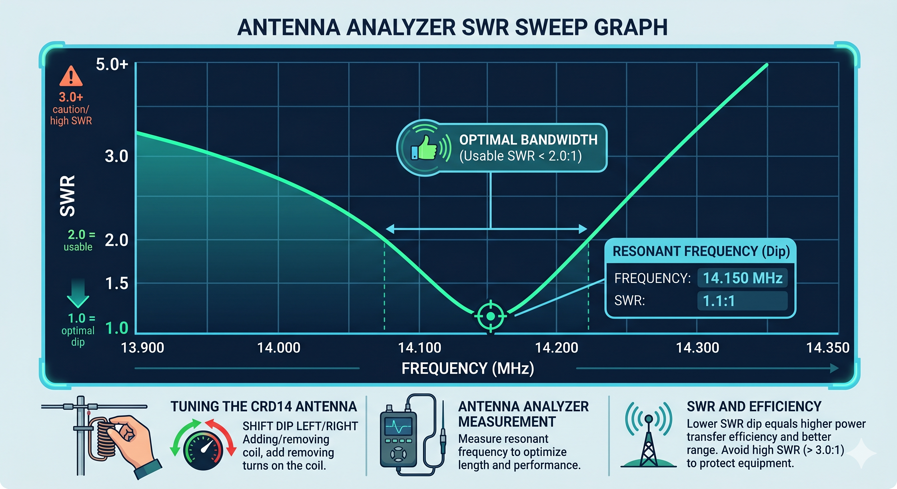

# Project 14-275: The Compact 20M High-Efficiency Loaded Dipole 

**Frequency Target:** 14.275 MHz (Voice/SSB Operation)
This guide covers building a high-efficiency, shortened dipole. This design is perfect for Field Day or home use where space is tight, and we’re using a "P-Clamp" method so you can build this without needing a drill press.

## Performance Expectations
Because this antenna is roughly 20% of a full-sized dipole, it’s compact but comes with a trade-off. You can expect about 10–15% radiation efficiency. While that sounds like a lot of loss, 10 watts of radiated power is still plenty for making contacts worldwide. Just keep in mind that the bandwidth is very narrow—you will need an antenna tuner to move around the band.

## I. The Parts List
I’ve selected these parts because they are easy to source without requiring specialized tools. You can find them at distributors like McMaster-Carr or DX Engineering.

| Part | Specification | Source | Ref# |
| :---: | :---: | :---: | :---: |
| Backing Plate | HDPE or Delrin Sheet (1/2" x 4" x 6") | McMaster-Carr | 8658K51 |
| Element Clamps | Rubber-Cushioned P-Clamps (size to tubing) | McMaster-Carr | 3225T12 (1/2") |
| Radiators | 6063 Aluminum Tubing (1/2" OD, 3-ft sections) | DX Engineering | DXE-AT1200 | 
| Feed Connector | SO-239 Chassis Mount | DX Engineering | AML-83-1R |
| RF Jumpers | Braided Copper Grounding Strap (1/2") | McMaster-Carr | 9840K11 | 
| Coil Forms | 1.5" Schedule 40 PVC Pipe (cut to 6") | Hardware Store | Conduit | 
| Coil Wie | 12 AWG Enameled Magnet Wire | Magnet Wire Source | 12 AWG |

## II. Step-by-Step Build
### Step 1: Fabricate the Loading Coils
Inductors are the heart of this antenna. For 14.275 MHz, you need a precise number of turns to get the resonance right.

1. Take two 6-inch sections of PVC pipe to use as coil forms. Drill a 3/16-inch hole at the top and bottom of each form.
2.	Mount stainless steel 10-24 bolts through these holes to act as wire terminals.
3.	Wind 11 turns of 12 AWG magnet wire around each form. Important: Keep a small, consistent gap between each turn—about one wire-width thick. This spacing is what keeps your efficiency high.
4.	Secure the ends of the wire firmly under the nuts on your bolts.

### Step 2: Base Plate Assembly

The base plate holds everything together. Using P-clamps makes this extremely rigid even if you only have a hand drill.
[Image of rubber cushioned loop clamps p-clamps]

1.	Lay your HDPE base plate flat.
2.	Arrange your P-clamps in two pairs on the plate, one pair for the left side and one for the right.
3.	Slide your aluminum tubing into the clamps. Critical: Leave a 2-inch gap between the inner tips of the aluminum tubes at the center of the plate. If they touch, you have a short circuit.
4.	Use your hand drill to create bolt holes through the plate for your P-clamps and bolt them down tight.

### Step 3: Feed Point Wiring and Calibration

Now we connect the feedline to the antenna arms.
1.	Mount your SO-239 connector to the center of the base plate.
2.	Use your copper braided straps to connect the SO-239 center pin to the left arm, and the ground flange to the right arm.
3.	Use a dab of Noalox or similar anti-oxidant grease on all metal-to-metal joints to stop corrosion.
4.	Mount the loading coils onto the aluminum arms, roughly 6 inches out from the center block.

## III. Tuning for 14.275 MHz

Tuning is a process of checking your SWR dip with an analyzer and making symmetric adjustments.

- **If resonance is too low (below 14.275 MHz):** You have too much inductance. Symmetrically compress the turns on both coils to push the resonance frequency higher.
- **If resonance is too high (above 14.275 MHz):** You need more inductance. Symmetrically spread the coil turns slightly to pull the resonance frequency down.
- Once your analyzer shows a dip at 14.275 MHz, use weather-sealing tape to protect the feed point from the elements.

